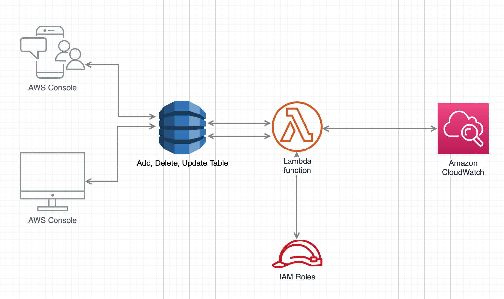

## AWS Monitor DynamoDB Streams
This is a sample that shows how you can build a NodeJs AWS Lambda service that can monitor DynamoDB streams and place the monitored events in AWS Cloud Watch.

The following diagram illustrates the design:

## How to build and run this sample in your AWS Cloud Instance
### You need to do the following:
1. Create a DynamoDB table with any name, let's call it `myTable123`, and add some data to this table. Make sure to enable streaming in `myTable123` by selecting getting old and new image option.

2. Create a Lambda function and set the source trigger of your Lambda function to be the DynamoDB table `myTable123`.

3. Give Lambda access permissions on DynamoDB and CloudWatch.

4. Edit or add to or delete from `myTable123`.

5. Checkout CloudWatch logs, which will have all the details of the records before the table change and after the table change.
